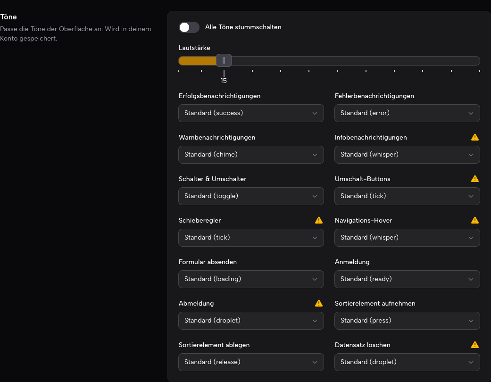

# Filament AudioFeedback

[](https://packagist.org/packages/blemli/filament-audiofeedback)
[](https://github.com/blemli/filament-audiofeedback/actions?query=workflow%3Atests+branch%3A5.x)
[](https://packagist.org/packages/blemli/filament-audiofeedback)

Delightful, unobtrusive audio feedback for Filament panels, powered by [Cuelume](https://cuelume-site.pages.dev) — fourteen tiny interaction sounds synthesized live with the Web Audio API. No audio files, no npm install, nothing to configure unless you want to.

Deliberately not annoying: sounds play for toggles, notifications, form submits, sliders, login/logout, drag & drop, and a barely-there whisper on navigation hover. Users get a mute button, a master volume, and (optionally) their own per-sound settings on Filament Breezy's my-profile page — persisted to the database.

## Installation

```bash
composer require blemli/filament-audiofeedback
```

Add the plugin to your panel — that's it:

```php
use Blemli\AudioFeedback\AudioFeedbackPlugin;

public function panel(Panel $panel): Panel
{
    return $panel
        // ...
        ->plugin(AudioFeedbackPlugin::make());
}
```

The Cuelume engine (~10 kB, MIT) is bundled with the plugin and registered through Filament's asset system. No Filament views are overridden — everything hooks into Livewire events, DOM roles and render hooks.

## What plays when

Each event maps to the Cuelume sound designed for that exact moment:

| Event | Default sound | Cuelume's description |
| --- | --- | --- |
| Notification (success) | `success` | Warm three-note confirmation |
| Notification (danger) | `error` | Soft knock and descending refusal |
| Notification (warning) | `chime` | Soft two-note ascending bell |
| Notification (info / none) | `whisper` | Breathy quiet swell |
| Toggle switched | `toggle` | Mechanical click-clack |
| Toggle buttons changed | `toggle-buttons` → `tick` | Crisp instant tick |
| Slider released / stepped | `slider` → `tick` | Crisp instant tick |
| Navigation item hovered | `nav.hover` → `whisper` | The quietest option, made for dense lists |
| Form submitted | `loading` | Brief unresolved rising shimmer |
| Login | `ready` | Focus tick with a harmonic bloom |
| Logout | `droplet` | Single note gliding down |
| Drag (grab a sortable item) | `press` | Dull muted knock |
| Drop (release it) | `release` | Brighter springy tick |
| Record deleted | `delete` → `droplet` | Single note gliding down |

## Configuration

Publish the config file if you want to change anything:

```bash
php artisan vendor:publish --tag="audiofeedback-config"
```

```php
// config/audiofeedback.php
return [
    'enabled' => env('AUDIOFEEDBACK_ENABLED', true),

    // Master volume, 0–100. Users can pick their own (see below).
    'volume' => 50,

    // The mute button is shown by default; opt out with false.
    'mute_toggle' => true,

    // 'topbar-start', 'topbar-end', 'user-menu-before' or 'user-menu'.
    'mute_toggle_position' => 'user-menu-before',

    // Opt in to a per-user "Sounds" section on Breezy's my-profile page.
    'breezy_profile_section' => false,

    // Any of: chime, sparkle, droplet, bloom, whisper, tick, press,
    // release, toggle, success, error, page, loading, ready — or false.
    'sounds' => [
        'notification.success' => 'success',
        'toggle' => 'toggle',
        'nav.hover' => false, // silence a single event
        // ...
    ],
];
```

The same options are available fluently on the plugin:

```php
AudioFeedbackPlugin::make()
    ->volume(25)
    ->sound('toggle', 'tick')
    ->disable('form.submit', 'drag', 'drop')
    ->muteToggle(position: 'topbar-end');
```

Or globally from your `AppServiceProvider`:

```php
use Blemli\AudioFeedback\AudioFeedbackPlugin;

public function boot(): void
{
    AudioFeedbackPlugin::configureUsing(
        fn (AudioFeedbackPlugin $plugin) => $plugin->sound('login', 'bloom'),
    );
}
```

Precedence: config file → `configureUsing()` → fluent calls in the panel provider.

## Notifications

Notifications automatically play the sound matching their status. Override or silence a single notification:

```php
Notification::make()
    ->title('Saved')
    ->success()
    ->sound('sparkle') // override the status sound
    ->send();

Notification::make()
    ->title('Autosaved')
    ->silent() // no sound for this one
    ->send();

Notification::make()
    ->title('Gone')
    ->soundEvent('delete') // play a configured event's sound instead
    ->send();
```

Delete and force-delete actions (including bulk) automatically use the `delete` event's sound for their success notification instead of the generic success chime.

## Mute button

A small speaker icon lets every user opt out. It is shown by default (opt out with `->muteToggle(false)`) and can live in four places, matching Filament's render hooks:

```php
use Blemli\AudioFeedback\MuteTogglePosition;

AudioFeedbackPlugin::make()->muteToggle(position: MuteTogglePosition::UserMenu);
```

| Position | Where |
| --- | --- |
| `topbar-start` | Start of the topbar, after the logo |
| `topbar-end` | End of the topbar, before the user menu area |
| `user-menu-before` | Next to the user avatar (default) |
| `user-menu` | An item inside the user dropdown |

## Per-user settings (Filament Breezy)

If your panel uses [Filament Breezy](https://github.com/jeffgreco13/filament-breezy), opt in to a "Sounds" section on the my-profile page:

```php
AudioFeedbackPlugin::make()->breezyProfileSection();
```



Each user gets a mute switch, a volume slider (with a marker and reset for the panel default), and a per-event sound picker — every sound can be re-mapped to any of the fourteen cues, muted, or left at the panel default, with an instant preview on selection. The section only appears when the `BreezyCore` plugin is registered on the same panel; hide it per-panel with Breezy's `->withoutMyProfileComponents(['audiofeedback'])`.

Choices are saved to the `audiofeedback_settings` table (the migration ships with the package — just run `php artisan migrate`) via a small authenticated endpoint, so they follow the user across browsers. Guests and apps without the table gracefully fall back to `localStorage`.

## Extras
- **Your own sounds** — the script also honors plain Cuelume attributes in your views (`<button data-cuelume-press>`), and exposes `window.audiofeedback.cue('toggle')` / `window.audiofeedback.play('sparkle')` for custom JS.
- **Autoplay policy** — browsers block audio before the first user interaction on a page. Cues that arrive earlier (e.g. right after the login redirect) are held and played on the first click or keypress.
  
## Testing

```bash
composer test
```

## Credits

- [Cuelume](https://github.com/Danilaa1/cuelume) by Daniel Belyi — the sound palette (MIT)
- [grafst](https://github.com/grafst)

## License

The MIT License (MIT). Please see [License File](LICENSE.md) for more information.
